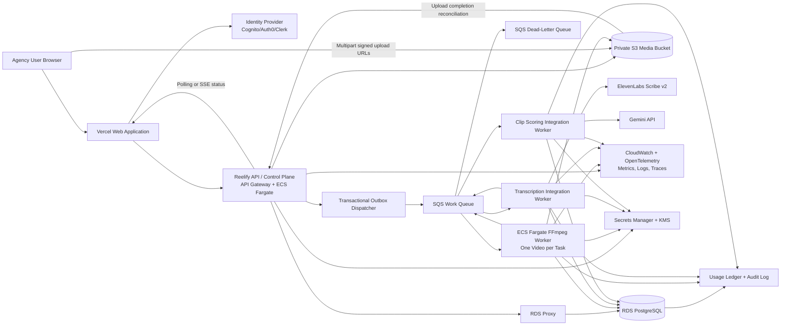

# 1. Executive Summary

Reelify should move all FFmpeg work out of the browser and into an asynchronous backend media-processing pipeline. The browser should only upload source videos directly to private object storage, create or confirm a durable processing job, and display persistent job progress and results.

**Primary recommendation:** use a hybrid AWS architecture:

- Keep the web application on Vercel or another frontend host.
- Host the API/control plane as a lightweight AWS service.
- Store source video and derived media in Amazon S3.
- Use PostgreSQL as the source of truth for tenants, workspaces, videos, jobs, transcripts, and clip candidates.
- Use Amazon SQS plus a transactional outbox for durable asynchronous orchestration.
- Run FFmpeg in isolated, one-video-per-task ECS Fargate workers.
- Separate CPU-heavy media workers from lightweight transcription/scoring integration workers.
- Use ElevenLabs Scribe v2 behind a transcription-provider adapter.
- Use Gemini behind a clip-scoring-provider adapter.
- Use polling first, with optional Server-Sent Events later for richer live progress.

This design directly addresses browser instability, large-file memory limits, synchronous timeout risk, tenant isolation, retries, provider outages, and cost attribution. It also creates a clean path to future rendering, captions, approvals, and publishing features. 

The key architectural principle is:

```text
Browser uploads data.
API records intent and authorization.
Queues distribute durable work.
Workers process media asynchronously.
PostgreSQL records truth.
Object storage holds large artifacts.
```


# 2. Key Assumptions


| Area                       | Planning assumption                                                                                                                                                                                                    |
| -------------------------- | ---------------------------------------------------------------------------------------------------------------------------------------------------------------------------------------------------------------------- |
| Primary cloud              | AWS, region-aware from day one: launch in one primary data region (likely `us-east-1` or `us-west-2` if most early customers are in the U.S.); expand to regional data planes later without changing core architecture |
| Frontend                   | Existing web application can remain on Vercel                                                                                                                                                                          |
| Database                   | PostgreSQL is the authoritative transactional datastore                                                                                                                                                                |
| Video size                 | Typical source file: 3–5 GB                                                                                                                                                                                            |
| Video duration             | Sensitivity analysis covers 60, 90, 120, and 180 minutes                                                                                                                                                               |
| Audio extraction           | Audio-only extraction, not full video transcoding, in the initial workflow                                                                                                                                             |
| Audio format               | Default benchmark candidate: mono 16 kHz FLAC or compressed Opus; choose based on Scribe quality and accepted formats                                                                                                  |
| FFmpeg worker shape        | One source video per worker task                                                                                                                                                                                       |
| Worker starting allocation | 2 vCPU, 8 GiB RAM, 30–40 GiB ephemeral disk                                                                                                                                                                            |
| Job delivery               | At-least-once queue delivery; application-level idempotency is mandatory                                                                                                                                               |
| Progress delivery          | Polling first; SSE is an additive optimization, not the source of truth                                                                                                                                                |
| Retention baseline         | Originals retained in hot storage for 90 days, then transitioned to lower-cost archival or intelligent-tiering storage unless an agency chooses a longer hot-retention policy                                          |
| User identity              | Managed identity provider such as Amazon Cognito, Auth0, Clerk, or WorkOS; application-level tenant authorization remains in Reelify’s database                                                                        |
| Pricing                    | Cost figures below are planning estimates, not current vendor quotations. Live vendor-price verification was unavailable in this chat on June 27, 2026. Revalidate all prices before commercial commitments.           |


Useful workload formulas:

```text
theoretical_max_jobs
= agencies × employees_per_agency × 3

realistic_concurrent_jobs
= agencies × average_employees × 3 × active_utilization_rate

monthly_video_hours
= agencies × videos_per_agency_per_month × average_video_duration_hours

monthly_new_storage_gb
= monthly_videos × average_video_size_gb
```


# 3. Architecture Recommendation

Use a **hybrid architecture with a lightweight web/API control plane and isolated containerized media workers**.

## Recommended service layout


| Component                      | Recommendation                                                                            | Why                                                                                    |
| ------------------------------ | ----------------------------------------------------------------------------------------- | -------------------------------------------------------------------------------------- |
| Web application                | Vercel-hosted Next.js or equivalent                                                       | Fast iteration, existing compatibility, static delivery, browser-facing UX             |
| Authentication                 | Cognito, Auth0, Clerk, or WorkOS                                                          | Managed login, MFA, future SSO support; Reelify still enforces workspace authorization |
| API/control plane              | ECS Fargate service behind API Gateway or ALB; Lambda is acceptable for smaller endpoints | Lightweight, horizontally scalable, does not run FFmpeg                                |
| Relational database            | Amazon RDS PostgreSQL, Multi-AZ in production                                             | Strong transactions, relational tenant model, reliable job state                       |
| Database connection management | RDS Proxy or pooled application connections                                               | Avoids connection storms and improves failure recovery                                 |
| Object storage                 | Amazon S3 with private buckets                                                            | Durable, scalable, multipart upload, lifecycle controls                                |
| Upload layer                   | S3 multipart upload with short-lived signed URLs                                          | Supports resumable uploads without proxying 3–5 GB videos through Reelify servers      |
| Durable queue                  | Amazon SQS Standard plus DLQ                                                              | Cheap buffering, at-least-once delivery, resilient retries                             |
| Workflow persistence           | PostgreSQL job state plus transactional outbox                                            | Prevents queue/database dual-write inconsistencies                                     |
| FFmpeg workers                 | ECS Fargate tasks, one video per task                                                     | Long-running containers, CPU/disk control, no browser dependency                       |
| AI integration workers         | Small Fargate tasks or Lambda-based integration workers                                   | Keeps expensive FFmpeg capacity separate from API polling and provider calls           |
| Observability                  | OpenTelemetry, CloudWatch, managed metrics/logging, optional Sentry                       | Job-level troubleshooting, cost and error visibility                                   |
| Secrets                        | AWS Secrets Manager plus KMS                                                              | Central rotation, task-role retrieval, no secrets in frontend                          |
| Infrastructure as code         | Terraform, Pulumi, or AWS CDK                                                             | Reproducible environments, reviewable changes                                          |
| Billing/metering               | Immutable usage-event ledger plus monthly aggregates                                      | Supports included credits, overages, agency-level cost visibility                      |


## Why this is the best fit

This is better than frontend FFmpeg because:

- Browser hardware no longer determines whether jobs succeed.
- Videos are not held in browser memory.
- Processing survives refreshes, disconnects, browser crashes, and closed tabs.
- The worker environment is reproducible and observable.
- Audio extraction can be retried without requiring another upload.
- Sensitive raw media does not need to pass through a public frontend workflow.
- Each job can be costed, rate-limited, and attributed to an agency and workspace.

This is safer than ordinary serverless request handlers because FFmpeg workloads need:

- Long execution windows.
- Controlled CPU and RAM.
- Bounded temporary disk.
- Stable runtime dependencies.
- Explicit process cancellation.
- Isolation from normal API latency and concurrency.
- Strong protection against a media spike consuming all request capacity.


## Core deployment model

```text
Control plane
- Authenticate users.
- Enforce agency/workspace permissions.
- Create upload sessions.
- Persist jobs and state transitions.
- Generate signed URLs.
- Publish work through an outbox.

Data plane
- Download media to bounded local worker disk.
- Run FFmpeg.
- Upload audio artifacts.
- Call transcription/scoring providers.
- Persist normalized results.
- Emit stage events and usage events.
```


## Region-aware deployment strategy

The core architecture does not need to change. S3, PostgreSQL, SQS, Fargate workers, and the asynchronous workflow remain appropriate.

However, the deployment strategy should become **region-aware from day one**.

### Recommended early approach

Start with one primary data region, likely a U.S. AWS region if most early customers are in the U.S.

For example:

```text
Initial primary region:
us-east-1 or us-west-2
```

Store there:

- Source videos
- Derived audio
- PostgreSQL tenant data
- Processing jobs
- Transcripts
- Clip candidates
- Logs containing tenant metadata

This is the lowest-cost and lowest-complexity launch model.

But each agency should have an **immutable** `data_region` field from the beginning:

```text
agencies.data_region = "us"
```

Later:

```text
agencies.data_region = "us" | "uk" | "ca" | "au" | "eu" | ...
```

That small schema decision makes regional expansion much easier.

### Recommended later regional model

**Global control plane**

- Authentication
- Billing
- Tenant directory
- Product configuration

**Regional data plane**

- Regional S3 bucket
- Regional PostgreSQL database
- Regional queue
- Regional Fargate worker pool
- Regional encryption keys

Example:

```text
U.S. tenant
  -> U.S. S3, U.S. workers, U.S. database

U.K. tenant
  -> U.K. S3, U.K. workers, U.K. database

Australian tenant
  -> Australian S3, Australian workers, Australian database
```


### Changes worth making now


| Area               | Recommendation                                                                          |
| ------------------ | --------------------------------------------------------------------------------------- |
| Tenant record      | Add immutable `data_region` to `agencies`                                               |
| Object storage     | Include region/account routing in storage configuration, not in client-controlled input |
| Database design    | Keep tenant data self-contained enough to move an agency later                          |
| KMS                | Use regional keys for regional data                                                     |
| AI providers       | Confirm where ElevenLabs and Gemini process data before promising residency             |
| Contracts          | Publish a clear subprocessor and data-transfer policy                                   |
| Upload performance | Benchmark large-file upload experience from Australia and the U.K.                      |
| Future routing     | Route API requests by the agency’s home region                                          |


### Important caveat

U.K., Canadian, Australian, and U.S. privacy obligations differ. The architecture can support strong controls, but legal claims about data residency, international transfers, or compliance should be validated with counsel and current vendor terms before making customer commitments.

The most important product statement at launch is simply to be precise:

> Customer content is stored and processed in [named region], subject to the processing locations of approved AI subprocessors.

Do not promise “data never leaves the U.K.” or similar wording until every downstream provider contract supports that statement.

# 4. Architecture Diagram in Mermaid




# 5. End-to-End Processing Flow


## 1. Create an upload session

The browser requests an upload session for a workspace.

The API:

1. Authenticates the user.
2. Verifies agency and workspace membership.
3. Creates a `VideoAsset` row with `UPLOADING` status.
4. Creates an S3 multipart upload.
5. Returns short-lived signed URLs for each part or signed part-generation permissions.
6. Returns an upload-session ID and idempotency key.

The browser uploads directly to S3. Reelify API servers never proxy a 3–5 GB video.

## 2. Upload completion

After all parts are uploaded, the browser calls upload completion.

The API:

1. Verifies the multipart upload completion details.
2. Uses S3 `HEAD` metadata to verify object size, checksum, and object version.
3. Marks the asset `UPLOADED`.
4. Writes an outbox record requesting job creation.
5. Creates a `ProcessingJob` with `QUEUED` status.
6. Returns immediately.

S3 upload-complete events may also be used as a reconciliation signal, but they should not be the sole source of truth because events can be duplicated, delayed, or arrive after a client retry.

## 3. Audio extraction

A queue message triggers an FFmpeg worker.

The worker:

1. Atomically claims the job attempt.
2. Verifies the job is not cancelled.
3. Downloads the original video to bounded ephemeral disk.
4. Runs `ffprobe` and FFmpeg.
5. Extracts audio to a temporary local artifact.
6. Uploads the audio artifact to S3.
7. Stores artifact metadata, duration, checksum, codec, and object key.
8. Marks the audio stage successful.
9. Enqueues transcription.

The worker never loads the full video into RAM.

## 4. Transcription

A transcription integration worker:

1. Reads the audio artifact metadata.
2. Streams the audio file from disk or object storage to ElevenLabs.
3. Persists provider request metadata and idempotency key.
4. Stores provider job IDs, response timestamps, model version, and normalized transcript.
5. Persists transcript words and timestamps.
6. Enqueues clip scoring.


## 5. Clip scoring

A scoring worker:

1. Loads the transcript and word-level timestamps.
2. Builds a structured Gemini request with a versioned prompt.
3. Requests strict JSON output using a schema.
4. Validates the response.
5. Filters candidates:

```text
score >= 65
duration >= 30 seconds
duration <= 90 seconds
```

1. Stores raw scoring response separately from normalized clip candidates.
2. Marks the job `COMPLETED`.


## 6. Progress delivery

For the first production version, use polling:

```text
GET /v1/processing-jobs/{jobId}
```

The response includes:

```json
{
  "id": "job_123",
  "status": "TRANSCRIBING",
  "stage": "TRANSCRIBING",
  "progressPercent": 62,
  "updatedAt": "2026-06-27T12:15:00Z",
  "nextPollAfterSeconds": 8,
  "failure": null
}
```

Later, add Server-Sent Events for active users:

```text
GET /v1/processing-jobs/{jobId}/events
```

Polling remains necessary for browser reloads, background tabs, and network reconnection.

# 6. Cloud Service Selection and Decision Matrix


## Decision matrix

Legend:

```text
Excellent = strong fit
Good = viable
Mixed = viable with meaningful compromises
Poor = not recommended for primary Reelify media processing
```


| Approach                                          | Operational complexity | Low-usage cost | Higher-usage cost            | FFmpeg compatibility | Timeout suitability | Temporary disk | Autoscaling | Reliability | Vendor lock-in         | Startup implementation | Reelify fit                |
| ------------------------------------------------- | ---------------------- | -------------- | ---------------------------- | -------------------- | ------------------- | -------------- | ----------- | ----------- | ---------------------- | ---------------------- | -------------------------- |
| Serverless functions only                         | Low                    | Excellent      | Mixed                        | Mixed                | Poor to Mixed       | Mixed          | Excellent   | Mixed       | High                   | Excellent              | Poor                       |
| Managed container workers                         | Medium                 | Good           | Good                         | Excellent            | Excellent           | Good           | Good        | Good        | Medium                 | Good                   | Excellent                  |
| AWS Batch-style jobs                              | Medium                 | Good           | Excellent                    | Excellent            | Excellent           | Good           | Excellent   | Excellent   | Medium                 | Mixed                  | Good                       |
| Kubernetes workers                                | High                   | Poor           | Excellent at sustained scale | Excellent            | Excellent           | Excellent      | Excellent   | Excellent   | Lower at runtime layer | Poor                   | Mixed now, Excellent later |
| Hybrid control plane + separate container workers | Medium                 | Good           | Excellent                    | Excellent            | Excellent           | Good           | Excellent   | Excellent   | Medium                 | Good                   | **Best choice**            |


## Recommended platform choices


| Need                  | Recommended AWS service                                        |
| --------------------- | -------------------------------------------------------------- |
| Private media storage | Amazon S3                                                      |
| Multipart uploads     | S3 Multipart Upload API                                        |
| API ingress           | API Gateway or ALB                                             |
| Lightweight API       | ECS Fargate service; Lambda acceptable for simple endpoints    |
| Relational state      | RDS PostgreSQL                                                 |
| Queueing              | SQS Standard plus DLQ                                          |
| Media workers         | ECS Fargate                                                    |
| Autoscaling           | ECS Service Auto Scaling, queue-depth and queue-age metrics    |
| Secrets               | Secrets Manager                                                |
| Encryption            | S3 SSE-KMS, RDS encryption, regional KMS keys per data plane   |
| Logs and metrics      | CloudWatch plus OpenTelemetry                                  |
| Container registry    | ECR                                                            |
| WAF / edge protection | AWS WAF plus CloudFront or API Gateway protections             |
| Backup                | RDS automated backups plus cross-region snapshots where needed |


## Why not serverless-only FFmpeg

Serverless request handlers are attractive for ordinary APIs, but poor as the primary media runtime because large-media jobs are vulnerable to:

- Runtime timeout limits.
- Temporary disk limits.
- CPU throttling or constrained runtime shapes.
- Memory pressure.
- Cold starts.
- Connection timeout behavior.
- Request-retry duplication.
- Difficulty implementing safe cancellation.
- Shared API capacity being consumed by media work.


## Why not Kubernetes now

Kubernetes becomes attractive when Reelify has:

- Hundreds of sustained workers.
- Specialized CPU pools.
- GPU rendering workloads.
- Significant savings from bin-packing.
- A platform engineer or mature SRE capability.
- Multi-region operational requirements.

It is not the best first production choice. ECS Fargate provides enough container flexibility without requiring cluster maintenance, node autoscaling, network plugins, or worker-node patching.

# 7. API and Job-Orchestration Design


## API design principles

- Every write endpoint accepts an `Idempotency-Key`.
- API responses return durable identifiers, not long-running results.
- Authorization is always checked against agency and workspace membership.
- Object storage paths are generated server-side.
- The database is the source of truth for status.
- Queue messages are derived through an outbox, not directly from request code.
- Every job stage is independently retryable.


## Main endpoints


| Endpoint                                              | Purpose                                         | Sync/async                       | Idempotency    |
| ----------------------------------------------------- | ----------------------------------------------- | -------------------------------- | -------------- |
| `POST /v1/workspaces/{workspaceId}/upload-sessions`   | Start multipart upload                          | Synchronous                      | Required       |
| `POST /v1/upload-sessions/{uploadSessionId}/parts`    | Generate signed part URLs                       | Synchronous                      | Recommended    |
| `POST /v1/upload-sessions/{uploadSessionId}/complete` | Confirm S3 multipart completion                 | Synchronous control-plane action | Required       |
| `POST /v1/videos/{videoId}/processing-jobs`           | Create/reuse a processing job                   | Synchronous control-plane action | Required       |
| `GET /v1/processing-jobs/{jobId}`                     | Fetch current job state                         | Synchronous read                 | Not applicable |
| `GET /v1/workspaces/{workspaceId}/videos`             | List workspace videos                           | Synchronous read                 | Not applicable |
| `GET /v1/videos/{videoId}/transcript`                 | Retrieve transcript                             | Synchronous read                 | Not applicable |
| `GET /v1/videos/{videoId}/clip-candidates`            | Retrieve scored clips                           | Synchronous read                 | Not applicable |
| `POST /v1/processing-jobs/{jobId}/cancel`             | Request cancellation                            | Synchronous control-plane action | Required       |
| `POST /v1/processing-jobs/{jobId}/retry`              | Retry a failed stage/job                        | Synchronous control-plane action | Required       |
| `DELETE /v1/videos/{videoId}`                         | Soft-delete video and schedule artifact erasure | Asynchronous deletion workflow   | Required       |


## Example: create upload session

```http
POST /v1/workspaces/ws_123/upload-sessions
Authorization: Bearer <JWT>
Idempotency-Key: 8f3d...

{
  "filename": "podcast-episode-42.mp4",
  "contentType": "video/mp4",
  "sizeBytes": 4294967296,
  "sha256": "optional-client-checksum"
}
```

Example response:

```json
{
  "uploadSessionId": "ups_123",
  "videoId": "vid_123",
  "multipartUploadId": "s3-upload-id",
  "partSizeBytes": 67108864,
  "expiresAt": "2026-06-27T13:00:00Z",
  "objectKey": "agencies/ag_123/workspaces/ws_123/videos/vid_123/source/v1/original.mp4"
}
```


## Example: complete upload

```http
POST /v1/upload-sessions/ups_123/complete
Authorization: Bearer <JWT>
Idempotency-Key: 91de...

{
  "parts": [
    { "partNumber": 1, "etag": "\"abc\"" },
    { "partNumber": 2, "etag": "\"def\"" }
  ]
}
```

Response:

```json
{
  "videoId": "vid_123",
  "status": "UPLOADED",
  "processingJobId": "job_123",
  "processingStatus": "QUEUED"
}
```


## Job state machine

```text
UPLOADING
  -> UPLOADED
  -> QUEUED
  -> PROCESSING_AUDIO
  -> TRANSCRIBING
  -> SCORING_CLIPS
  -> COMPLETED

Any active state
  -> CANCELLED
  -> FAILED
```

Recommended additional internal states:

```text
VALIDATING_MEDIA
WAITING_FOR_PROVIDER
RETRY_SCHEDULED
DELETION_PENDING
DELETED
```


## Orchestration pattern

Use PostgreSQL as the durable workflow state and implement a transactional outbox.

Example transaction:

```text
BEGIN;

1. Mark job stage as ready.
2. Insert processing_job_attempt.
3. Insert outbox_event:
   type = PROCESS_AUDIO
   payload = { job_id, attempt_id }

COMMIT;
```

A dispatcher process publishes the outbox event to SQS. It marks the outbox event delivered only after successful publication.

This avoids the dangerous failure mode:

```text
Database updated successfully
but queue message failed

or

Queue message sent successfully
but database transaction rolled back
```


# 8. Data Model


## Tenant model

Every tenant-owned table should include:

```text
agency_id
workspace_id where relevant
created_at
updated_at
deleted_at where soft deletion is required
```

PostgreSQL row-level security should be a defense-in-depth layer, not the sole authorization system.

## Core entities


| Entity                    | Primary key | Key fields and foreign keys                                                                                                      | Important indexes                                               |
| ------------------------- | ----------- | -------------------------------------------------------------------------------------------------------------------------------- | --------------------------------------------------------------- |
| `agencies`                | `id`        | name, plan, billing status, **immutable** `data_region` (e.g. `"us"` at launch; later `"us"`, `"uk"`, `"ca"`, `"au"`, `"eu"`, …) | unique slug; index on `data_region` where needed for routing    |
| `users`                   | `id`        | auth_subject, email, status                                                                                                      | unique auth subject, unique normalized email                    |
| `agency_users`            | `id`        | agency_id, user_id, role, status                                                                                                 | unique agency/user; agency/status                               |
| `workspaces`              | `id`        | agency_id, name, client name, status                                                                                             | agency/name; agency/status                                      |
| `workspace_memberships`   | `id`        | workspace_id, user_id, role                                                                                                      | unique workspace/user; user/workspace                           |
| `video_assets`            | `id`        | agency_id, workspace_id, object key, object version, checksum, size, duration, status                                            | workspace/created_at; agency/status; unique bucket/key/version  |
| `media_artifacts`         | `id`        | video_asset_id, artifact type, object key, checksum, storage class                                                               | video/type; unique object key/version                           |
| `processing_jobs`         | `id`        | video_asset_id, requested_by_user_id, pipeline version, status, cancellation flag                                                | video/status; workspace/status; active-job partial unique index |
| `processing_job_attempts` | `id`        | job_id, stage, attempt number, provider request ID, error fields                                                                 | job/stage/attempt; status/next_attempt_at                       |
| `transcripts`             | `id`        | video_asset_id, audio_artifact_id, provider, model, language, version                                                            | video/provider/model; artifact/checksum                         |
| `transcript_words`        | `id`        | transcript_id, sequence, token text, start/end milliseconds, confidence                                                          | transcript/sequence; transcript/start_ms                        |
| `clip_scoring_runs`       | `id`        | transcript_id, provider, model, prompt version, schema version                                                                   | transcript/prompt/model                                         |
| `clip_candidates`         | `id`        | scoring_run_id, transcript_id, start/end, duration, score, rank                                                                  | transcript/score desc; scoring_run/rank                         |
| `usage_events`            | `id`        | agency_id, workspace_id, video_id, job_id, stage, quantity, unit, cost estimate                                                  | agency/occurred_at; workspace/occurred_at; job                  |
| `usage_meters`            | `id`        | agency_id, billing period, metric, included/used/billed                                                                          | unique agency/period/metric                                     |
| `audit_logs`              | `id`        | actor, agency, workspace, action, target type/id, IP hash                                                                        | agency/created_at; target                                       |
| `outbox_events`           | `id`        | aggregate type/id, event type, payload, delivered_at                                                                             | undelivered/created_at                                          |


## Important statuses


### `video_assets.status`

```text
UPLOADING
UPLOADED
PROCESSING
READY
FAILED
DELETION_PENDING
DELETED
```


### `processing_jobs.status`

```text
QUEUED
PROCESSING_AUDIO
TRANSCRIBING
SCORING_CLIPS
COMPLETED
FAILED
CANCELLED
RETRY_SCHEDULED
```


### `processing_job_attempts.status`

```text
STARTED
SUCCEEDED
FAILED_RETRYABLE
FAILED_FINAL
CANCELLED
TIMED_OUT
```


## Tenant-isolation strategy

Authorization should occur at three layers:

1. **Identity layer**
  Validate JWT issuer, audience, expiration, and user identity.
2. **Application authorization layer**
  Verify that the authenticated user belongs to the agency and workspace referenced by the request.
3. **Database and storage defense-in-depth**
  - All tenant-owned records carry `agency_id`.
  - PostgreSQL row-level security restricts queries to the current agency context.
  - S3 object keys are tenant-scoped.
  - Signed URLs are generated only after authorization checks.
  - Buckets remain private and block public access.
  - Object storage bucket and region are resolved server-side from the agency’s `data_region`, never from client-controlled input.

Keep tenant-owned data self-contained enough that an agency can be migrated to a different regional data plane later without cross-table coupling to other agencies.

## Preventing duplicate transcripts and clip candidates

Use deterministic uniqueness constraints:

```text
Transcript uniqueness:
(audio_artifact_checksum, provider, provider_model, language, transcript_version)

Scoring uniqueness:
(transcript_id, provider, model, prompt_version, output_schema_version)

Candidate uniqueness:
(scoring_run_id, start_ms, end_ms)
```

A retry should first check whether an equivalent successful artifact or transcript already exists. If it does, it should reuse it rather than create a duplicate.

## Cost attribution

Every stage emits a `usage_event`.

Examples:

```text
VIDEO_STORAGE_GB_HOUR
SOURCE_VIDEO_UPLOAD_GB
FFMPEG_TASK_SECOND
TRANSCRIPTION_AUDIO_MINUTE
GEMINI_INPUT_TOKEN
GEMINI_OUTPUT_TOKEN
CLIP_RENDER_MINUTE
DATA_EGRESS_GB
```

This supports:

- Per-agency cost visibility.
- Workspace-level profitability.
- Per-video margin analysis.
- Billing credits and overages.
- Provider anomaly detection.
- Internal gross-margin reporting.


# 9. FFmpeg Worker Design


## Worker execution model

Use **one video per FFmpeg worker task**.

Do not process multiple large videos concurrently inside one worker process.

Reasons:

- Better CPU isolation.
- Better memory isolation.
- Easier cancellation.
- Easier retries.
- Easier resource accounting.
- Fewer noisy-neighbor failures.
- Cleaner task-level observability.
- Lower risk that one corrupt video affects unrelated jobs.

Scale horizontally by running more tasks, not by increasing internal worker concurrency.

## Container image strategy

Use a dedicated image in Amazon ECR.

Recommended design:

```text
Base image:
- Minimal supported Linux distribution.

Runtime:
- Pinned FFmpeg version.
- Pinned ffprobe version.
- Non-root application user.
- No package manager in production image.
- Read-only root filesystem where compatible.
- Explicit writable mount for /work.
```

Build and test images in CI.

Track:

```text
ffmpeg_version
container_image_digest
pipeline_version
codec_support_profile
```

Store these values on each processing attempt.

## Starting resource allocation


| Worker profile                | CPU      | Memory    | Ephemeral disk | Use                               |
| ----------------------------- | -------- | --------- | -------------- | --------------------------------- |
| Standard extraction           | 2 vCPU   | 8 GiB     | 30–40 GiB      | Typical 3–5 GB source video       |
| Large/high-bitrate extraction | 4 vCPU   | 16 GiB    | 50–80 GiB      | 4K, complex codecs, long sources  |
| Future rendering              | 4–8 vCPU | 16–32 GiB | 80+ GiB        | Caption burn-in, clips, templates |


Start with standard workers and use metrics to identify videos needing the larger worker class.

## Disk handling

Do not stream full 3–5 GB source videos into application memory.

Recommended baseline:

```text
S3 source video
  -> bounded local ephemeral disk
  -> ffprobe
  -> FFmpeg audio extraction
  -> local temporary audio file
  -> stream upload to AI provider and/or S3
  -> cleanup
```

For a 5 GB source video, allocate enough disk for:

```text
source video
+ temporary audio
+ FFmpeg overhead
+ partial retries
+ safety buffer
```

A 30–40 GiB temporary disk is a practical minimum for the initial source sizes.

## Streaming versus local files


| Approach                         | Benefits                                                       | Drawbacks                                                       | Recommendation   |
| -------------------------------- | -------------------------------------------------------------- | --------------------------------------------------------------- | ---------------- |
| Fully streaming source to FFmpeg | Lower local disk use                                           | More fragile seeking, poor retry behavior, harder codec probing | Avoid as default |
| Download to bounded local disk   | Predictable behavior, supports seeking/probing, simple cleanup | Requires ephemeral disk sizing                                  | Recommended      |
| Shared network filesystem        | Persistent scratch space                                       | Cost, throughput variability, unnecessary complexity            | Avoid initially  |
| Entire file in memory            | Fast in narrow cases                                           | Unsafe for 3–5 GB media                                         | Never use        |


## Example extraction behavior

A likely baseline command shape:

```bash
ffmpeg \
  -nostdin \
  -hide_banner \
  -v error \
  -i /work/source-video \
  -vn \
  -ac 1 \
  -ar 16000 \
  -c:a flac \
  /work/audio.flac
```

Benchmark at least two profiles:

```text
Profile A: 16 kHz mono FLAC
Profile B: 24–32 kbps mono Opus
```

Choose the cheaper format only if transcription quality remains acceptable across podcasts, interviews, remote calls, webinars, and poor-quality recordings.

## Validation and malicious-input handling

Before running extraction:

1. Verify S3 object size against expected upload size.
2. Run `ffprobe`.
3. Reject unsupported codecs or malformed media.
4. Enforce file-size and duration guardrails.
5. Run FFmpeg as a non-root user.
6. Limit CPU, memory, process count, and disk.
7. Use network restrictions so the media container can reach only required services.
8. Treat user-uploaded media as untrusted input.

Potential result states:

```text
INVALID_MEDIA
UNSUPPORTED_CODEC
CORRUPT_MEDIA
SOURCE_TOO_LARGE
SOURCE_TOO_LONG
FFMPEG_TIMEOUT
FFMPEG_INTERNAL_ERROR
```


## Timeouts

Timeouts should be dynamic rather than one global number.

Example policy:

```text
audio_extraction_timeout
= min(
    3 hours,
    max(20 minutes, 20 minutes + 0.75 × source_duration)
  )
```

The exact formula should be tuned using observed stage duration percentiles.

## Cancellation behavior

Cancellation should be cooperative:

1. API sets `cancel_requested_at`.
2. Worker checks cancellation before every major step.
3. During FFmpeg processing, worker sends `SIGTERM`.
4. After a grace period, worker force-stops the child process.
5. Worker deletes temporary files.
6. Worker marks the attempt `CANCELLED`.
7. Future stages are prevented from starting.

A cancellation request may not stop an already-submitted third-party transcription request. The UI should communicate that cancellation is best-effort once an external provider has accepted a request.

## Audio retention policy

Recommended default:

```text
Temporary audio:
retain for 7–30 days after transcript success

Reason:
- Supports debugging and short-term reprocessing.
- Limits storage growth.
- Avoids retaining duplicate copies of source content indefinitely.
```

For a re-transcription request after audio expiration, re-extract audio from the original video.

# 10. AI Provider Integration Design


## Provider abstraction

Use explicit interfaces, not direct provider calls scattered through the application.

```typescript
interface TranscriptionProvider {aws
  submit(input: TranscriptionInput): Promise<TranscriptionSubmission>;
  getStatus(providerJobId: string): Promise<TranscriptionStatus>;
  fetchResult(providerJobId: string): Promise<NormalizedTranscript>;
}

interface ClipScoringProvider {
  score(input: ClipScoringInput): Promise<ClipScoringResult>;
}
```

This enables:

- Provider replacement.
- A/B testing.
- Failover.
- Contracted enterprise endpoints.
- Future self-hosted or alternate transcription options.
- Re-scoring without re-transcribing.


## AI provider data processing locations

Before promising data residency to customers, confirm where ElevenLabs and Gemini actually process submitted audio and transcript payloads. Vendor processing locations may differ from Reelify’s AWS region and should be documented in the subprocessor list and customer-facing data-transfer policy.

## ElevenLabs Scribe integration

Persist:

```text
provider = ELEVENLABS
provider_model
provider_request_id
audio_checksum
audio_duration_seconds
request_timestamp
response_timestamp
provider_status
retry_count
normalized transcript version
raw response storage key
```

Avoid saving unnecessary raw provider payloads in PostgreSQL. Store encrypted large raw responses in object storage and retain a normalized relational representation.

## Gemini clip-scoring integration

Persist:

```text
provider = GEMINI
model identifier
prompt version
system instruction version
input schema version
output schema version
input token estimate
output token count
raw response object key
validation errors
score-run status
```

A clip-scoring request should include:

- Transcript text.
- Word-level time ranges.
- Speaker labels if available.
- Clear scoring rubric.
- Required JSON schema.
- Explicit duration constraints.
- Prompt version.
- Model identifier.

Example conceptual output shape:

```json
{
  "clips": [
    {
      "startMs": 183000,
      "endMs": 246000,
      "score": 82,
      "title": "Why consistency beats motivation",
      "hook": "Most people rely on motivation...",
      "reasoning": "Clear thesis, emotionally resonant opening, self-contained insight."
    }
  ]
}
```

The worker validates:

```text
startMs < endMs
duration is between 30 and 90 seconds
score is numeric
score >= 65
timestamps fit transcript duration
no duplicate or near-duplicate intervals
```


## Rate limits and concurrency controls

Apply controls at multiple levels:


| Control                         | Purpose                                                 |
| ------------------------------- | ------------------------------------------------------- |
| Global provider concurrency cap | Avoid exceeding provider throughput                     |
| Per-agency concurrency cap      | Prevent one agency from monopolizing AI spend           |
| Per-workspace concurrency cap   | Avoid accidental repeated uploads from one client       |
| Token bucket rate limiter       | Smooth request bursts                                   |
| Queue backlog cap               | Protect against runaway demand                          |
| Cost ceiling                    | Pause work when a tenant exceeds paid or approved usage |


Recommended starting policy:

```text
Per agency:
- 2 active media jobs
- 2 active transcription requests
- 3 active scoring requests

Global:
- Start below documented provider quotas.
- Increase only after observing stable latency and error rates.
```


## Retry policy


| Failure category                | Retry?                           | Notes                                               |
| ------------------------------- | -------------------------------- | --------------------------------------------------- |
| Network timeout                 | Yes                              | Exponential backoff with jitter                     |
| HTTP 429 / provider quota       | Yes                              | Respect `Retry-After`; reduce effective concurrency |
| Provider 5xx                    | Yes                              | Limited retry budget                                |
| Invalid API credentials         | No                               | Alert immediately                                   |
| Unsupported media               | No                               | User-visible failure                                |
| Corrupt provider response       | Yes once, then manual review/DLQ | Preserve raw response                               |
| JSON schema failure from Gemini | Retry with repair prompt once    | Do not loop indefinitely                            |
| Input too large                 | No, route to chunking strategy   | Requires structured remediation                     |
| Provider outage                 | Pause/retry later                | Do not continuously burn attempts                   |


Recommended retry cadence:

```text
Attempt 1: immediate
Attempt 2: 1–2 minutes
Attempt 3: 5–10 minutes
Attempt 4: 30 minutes
Attempt 5: 2 hours
Then: DLQ/manual review
```


## Independently retryable stages

These should be retried independently:

```text
Upload validation
FFmpeg extraction
Audio upload
Transcription submission
Transcription status polling
Transcript normalization
Gemini scoring
Scoring response validation
Clip candidate persistence
```

A scoring retry must not require another transcription. A transcription retry must not require another audio extraction when the audio artifact is valid.

# 11. Security, Tenant Isolation, and Compliance Considerations


## Tenant isolation

Use agency and workspace IDs everywhere.

Object-key convention:

```text
agencies/{agency_id}/workspaces/{workspace_id}/videos/{video_id}/source/{version}/original
agencies/{agency_id}/workspaces/{workspace_id}/videos/{video_id}/artifacts/{artifact_id}
agencies/{agency_id}/workspaces/{workspace_id}/videos/{video_id}/transcripts/{transcript_id}
```

Never authorize access based only on an S3 key prefix. Object paths are organizational controls, not permission checks.

## Authorization model

Suggested roles:

```text
Agency Owner
Agency Admin
Editor
Client Viewer
```

Examples:


| Action               | Minimum role |
| -------------------- | ------------ |
| Manage billing       | Agency Owner |
| Create workspace     | Agency Admin |
| Invite agency member | Agency Admin |
| Delete video         | Agency Admin |
| Upload video         | Editor       |
| Start/retry job      | Editor       |
| View transcript      | Editor       |
| Export clips         | Editor       |


## Object-storage controls

- Block public bucket access.
- Use short-lived signed upload URLs.
- Use short-lived signed download URLs.
- Restrict uploads to expected key, size, content type, and multipart upload ID.
- Resolve bucket and region from the agency’s `data_region` via server-side storage configuration; never accept bucket or region from the client.
- Use S3 object versioning where operationally appropriate.
- Use checksum verification.
- Use SSE-KMS encryption with regional KMS keys for regional data.
- Disable listing permissions for browser identities.
- Generate downloads through the API after RBAC checks.


## Network security

- API behind WAF and rate limiting.
- Workers in private subnets.
- Database not publicly accessible.
- VPC endpoints for S3, SQS, Secrets Manager, and CloudWatch where practical.
- Outbound access to AI providers controlled through a monitored egress path.
- Separate task roles for API, FFmpeg, transcription, and scoring workers.


## Secrets

Use Secrets Manager for:

```text
ElevenLabs API credentials
Gemini credentials
database credentials
JWT verification configuration
webhook signing secrets
billing-provider credentials
```

Never put provider keys in browser code, signed upload metadata, or client-visible logs.

## Privacy and compliance posture

Reelify will process customer media and transcripts that may contain personal information. The platform should support:

- Configurable retention.
- Export and deletion workflows.
- Data-processing agreements.
- Audit trails.
- Access logging.
- Region-aware deployment with immutable per-agency `data_region` from launch.
- Encryption at rest and in transit using regional KMS keys for regional data.
- Vendor subprocessor documentation and a clear data-transfer policy.
- Incident response runbooks.

U.K., Canadian, Australian, and U.S. privacy obligations differ. The architecture can support strong controls, but legal claims about data residency, international transfers, or compliance should be validated with counsel and current vendor terms before making customer commitments.

At launch, be precise rather than absolute. The recommended product statement is:

> Customer content is stored and processed in [named region], subject to the processing locations of approved AI subprocessors.

Do not promise “data never leaves the U.K.” or similar wording until every downstream provider contract supports that statement.

Do not claim formal compliance certifications until they are actually completed and independently verified.

# 12. Reliability, Retry, and Failure Handling


## Delivery semantics

Assume SQS delivers messages at least once.

This means every worker must safely tolerate:

```text
duplicate messages
worker crashes
visibility-timeout expiry
provider response timeouts
database transaction retries
out-of-order events
```


## Idempotent worker execution

Each stage should use an idempotency key such as:

```text
{job_id}:{stage}:{pipeline_version}:{artifact_checksum}
```

Worker claim pattern:

```text
1. Lock or compare-and-swap current job stage.
2. Verify the stage is still executable.
3. Create or reuse a stage attempt.
4. Execute only if no equivalent successful result exists.
5. Persist outcome atomically.
```


## Queue design

Use separate logical queues or message types:

```text
MEDIA_EXTRACT
TRANSCRIPTION_SUBMIT
TRANSCRIPTION_POLL
CLIP_SCORE
DELETE_MEDIA
RECONCILE_UPLOAD
```

Use DLQs for each queue class or a shared DLQ with explicit event type metadata.

## Retry classification


| Error                     | Handling                                         |
| ------------------------- | ------------------------------------------------ |
| FFmpeg malformed input    | Final failure, user-visible error                |
| Temporary S3 failure      | Retry                                            |
| Fargate worker crash      | Retry                                            |
| Database deadlock         | Retry transaction                                |
| ElevenLabs 429            | Retry with provider-specific backoff             |
| Gemini schema failure     | One repair attempt, then final failure or review |
| Job stuck in stage        | Watchdog reclaims lease and retries              |
| Duplicate upload complete | Return existing durable result                   |
| Cancellation race         | Cancellation wins before next stage starts       |


## Stuck-job watchdog

Run a periodic watchdog.

Examples:

```text
PROCESSING_AUDIO with no heartbeat for 20 minutes
TRANSCRIBING with no provider update for 30 minutes
SCORING_CLIPS with no heartbeat for 10 minutes
```

The watchdog should:

1. Mark the attempt stale.
2. Verify no active worker owns a valid lease.
3. Increment retry count.
4. Requeue if within retry budget.
5. Escalate to DLQ or manual review if exhausted.


## Disaster recovery baseline


| Area              | Baseline                                                                                   |
| ----------------- | ------------------------------------------------------------------------------------------ |
| Database          | Automated backups, point-in-time recovery, periodic restore tests                          |
| Object storage    | S3 durability, versioning where needed, optional cross-region replication for higher tiers |
| Queues            | Messages persisted by SQS; application state remains in PostgreSQL                         |
| Infrastructure    | IaC-based rebuild capability                                                               |
| Secrets           | Managed backups and rotation runbooks                                                      |
| Incident response | Runbooks for provider outage, queue backlog, accidental deletion, and DB failover          |


# 13. Observability and Operations


## Structured logging

Every log event should include:

```text
timestamp
environment
service
job_id
attempt_id
agency_id
workspace_id
video_id
stage
trace_id
worker_task_id
provider
provider_request_id
error_code
duration_ms
cost_estimate
```

Avoid logging raw transcripts, private video names, auth tokens, or signed URLs unless explicitly required and protected.

## Metrics


### API metrics

```text
request rate
p50/p95/p99 latency
4xx and 5xx rate
authorization failures
signed URL generation failures
idempotency conflicts
```


### Queue metrics

```text
queue depth
oldest message age
messages received
messages deleted
DLQ depth
retries per stage
```


### Worker metrics

```text
active workers
worker startup latency
CPU utilization
memory utilization
ephemeral disk utilization
FFmpeg exit codes
stage duration percentiles
failed media probes
cancelled jobs
```


### AI provider metrics

```text
submission rate
provider latency
429 rate
5xx rate
timeout rate
cost per audio minute
cost per input/output token
model error rate
schema-validation failure rate
```


### Business and cost metrics

```text
uploaded GB per agency
processed minutes per agency
completed clips per source video
cost per completed job
gross margin by agency
storage GB by workspace
retries per tenant
time to first candidate
time to completed job
```


## Alerts

Recommended alerts:


| Alert                | Example trigger                                              |
| -------------------- | ------------------------------------------------------------ |
| Stuck jobs           | Job has no heartbeat beyond stage threshold                  |
| Queue backlog        | Oldest message age exceeds target SLA                        |
| Provider error spike | 5xx or 429 rate above threshold                              |
| FFmpeg failure spike | Failure rate exceeds baseline                                |
| DLQ growth           | Any sustained DLQ increase                                   |
| Database health      | High CPU, disk, connection saturation, replication lag       |
| Cost anomaly         | Per-agency or global spend exceeds expected range            |
| Storage anomaly      | Sudden upload/storage growth                                 |
| Security event       | Repeated authorization denial or unusual signed URL issuance |


## Operations dashboard

Build a job-operations view with:

```text
Job status
Current stage
Attempts
Provider request IDs
Stage timings
Error code
Raw error details for internal staff
Retry button
Cancellation state
Usage/cost estimate
Object/artifact links for authorized administrators
```


# 14. Storage and Retention Strategy


## Storage classes


| Artifact               | Recommended storage                          | Retention                                       |
| ---------------------- | -------------------------------------------- | ----------------------------------------------- |
| Original source video  | S3 Standard or Intelligent-Tiering initially | Persist by workspace policy                     |
| Temporary worker files | Fargate ephemeral disk only                  | Delete when worker exits                        |
| Extracted audio        | S3 Standard / Intelligent-Tiering            | 7–30 days by default                            |
| Transcript and words   | PostgreSQL                                   | Retain with video/workspace unless deleted      |
| Raw AI responses       | Encrypted S3                                 | Short operational retention, such as 30–90 days |
| Clip candidate data    | PostgreSQL                                   | Retain with workspace                           |
| Future rendered clips  | S3 Standard initially, lifecycle later       | Configurable                                    |
| Audit logs             | Low-cost logs/object storage                 | 1–7 years depending on policy                   |
| Worker logs            | CloudWatch with export to S3                 | 30–90 days hot, longer archived                 |


## Lifecycle policy recommendation

```text
Day 0–90:
Original video in Standard or Intelligent-Tiering.

After 90 days:
Move inactive originals to lower-cost tier.

After 12–24 months:
Archive or delete depending on workspace retention policy.

Temporary extracted audio:
Delete after 7–30 days.

Failed or orphaned multipart uploads:
Abort after 1–7 days.

Soft-deleted video:
Inaccessible immediately.
Hard delete after configurable grace period, such as 30 days.
```


## Soft delete and hard delete

Recommended deletion workflow:

```text
1. Mark video as DELETION_PENDING.
2. Remove from normal workspace listings.
3. Revoke future signed URL issuance.
4. Queue object-artifact deletion.
5. Delete source and artifacts from S3.
6. Delete or anonymize transcript/candidate records.
7. Retain minimal billing/audit evidence where legally required.
8. Mark entity DELETED.
```

For customer-facing deletion requests, define whether clip candidates, transcripts, audit logs, and backup copies are included and document the expected completion window.

## Cost controls

- Use multipart-upload abort lifecycle rules.
- Delete temporary audio aggressively.
- Put raw provider payloads in lower-cost storage.
- Use storage quotas by plan.
- Charge for hot storage beyond included allowance.
- Add a restore or archival retrieval notice if storage tier introduces latency or retrieval charges.
- Monitor raw-video download egress, which can become costly.


# 15. Capacity Planning for Years 1–3


## Theoretical upper-bound concurrency

Formula:

```text
maximum_possible_concurrency
= agencies × maximum_employees_per_agency × 3 videos per employee
```


| Period | Agency range | Theoretical lower bound | Theoretical upper bound |
| ------ | ------------ | ----------------------- | ----------------------- |
| Year 1 | 35–220       | 35 × 2 × 3 = 210        | 220 × 15 × 3 = 9,900    |
| Year 2 | 83–567       | 83 × 2 × 3 = 498        | 567 × 15 × 3 = 25,515   |
| Year 3 | 149–1,102    | 149 × 2 × 3 = 894       | 1,102 × 15 × 3 = 49,590 |


These are not realistic steady-state workloads. They are a capacity-risk upper bound.

## Realistic utilization scenarios

Assume:

```text
Average employees per agency = 6
Maximum concurrent video slots per employee = 3
```

Planning agency counts:

```text
Year 1: 125 agencies
Year 2: 350 agencies
Year 3: 800 agencies
```

Theoretical slots under this planning model:

```text
Year 1: 125 × 6 × 3 = 2,250
Year 2: 350 × 6 × 3 = 6,300
Year 3: 800 × 6 × 3 = 14,400
```


| Period | Conservative utilization: 0.5% | Expected utilization: 2% | Aggressive utilization: 5% |
| ------ | ------------------------------ | ------------------------ | -------------------------- |
| Year 1 | 11 active jobs                 | 45 active jobs           | 113 active jobs            |
| Year 2 | 32 active jobs                 | 126 active jobs          | 315 active jobs            |
| Year 3 | 72 active jobs                 | 288 active jobs          | 720 active jobs            |


## Recommended worker caps


| Stage                         | Year 1 starting cap        | Year 2 likely cap          | Year 3 likely cap          |
| ----------------------------- | -------------------------- | -------------------------- | -------------------------- |
| FFmpeg extraction workers     | 5–20                       | 25–100                     | 100–300                    |
| Transcription requests        | Provider-quota constrained | Provider-quota constrained | Provider-quota constrained |
| Gemini scoring requests       | 10–30                      | 50–150                     | 150–500                    |
| Render/export workers, future | 0–5                        | 10–50                      | 50–250                     |


These are operational caps, not automatic scaling targets. Actual limits should be adjusted based on:

- Provider quotas.
- P95 stage durations.
- Cost per completed video.
- Queue age.
- Customer plan entitlements.
- Capacity reservation strategy.
- Failure rates.


## Queue-depth autoscaling policy

Recommended initial policy:

```text
Scale out when:
- visible queue depth per active worker > 2, or
- oldest media queue message > 5 minutes

Scale in when:
- queue is empty for 10–15 minutes, and
- active workers have no active job leases
```

Use both:

```text
queue depth
and
oldest message age
```

Queue depth alone can hide slow workers. Queue age shows customer-visible delay.

## Fair-use and tenant protection

Start with:

```text
Per workspace:
- 1 active media job

Per agency:
- 2 active media jobs
- 2 active transcriptions
- 3 active scoring jobs

Per plan:
- monthly processing-minute allowance
- storage allowance
- hard or soft overage policy
```

At larger scale, implement weighted fair scheduling:

```text
priority = plan_weight + waiting_time_bonus - current_tenant_active_jobs_penalty
```

This prevents a large agency from filling the entire global queue.

## Recommended starting infrastructure

```text
API:
- 2 small Fargate tasks across availability zones, or equivalent lightweight service.

Database:
- Small production-grade PostgreSQL instance with automated backups.
- Multi-AZ before meaningful paid customer volume.

Workers:
- One standard FFmpeg worker available during launch.
- Autoscale to 5–10 as early demand proves stable.

Queue:
- SQS with DLQ from day one.

Storage:
- Private S3 bucket with lifecycle policies from day one.

Region awareness:
- Single primary data region at launch (e.g. us-east-1 or us-west-2).
- Immutable agencies.data_region set to "us" for all early tenants.
- Server-side storage routing keyed off data_region, not client input.
```


## Evolution thresholds

Consider adding more advanced architecture when:


| Trigger                                      | Recommended evolution                                                                                                   |
| -------------------------------------------- | ----------------------------------------------------------------------------------------------------------------------- |
| Sustained 50+ active FFmpeg workers          | Tune worker profiles and introduce capacity classes                                                                     |
| Sustained 100+ active workers                | Evaluate AWS Batch or ECS on EC2/Spot for economics                                                                     |
| Rendering becomes a large workload           | Separate rendering queue and worker fleet                                                                               |
| GPU inference/rendering needed               | Add specialized compute pool                                                                                            |
| Non-U.S. customers or residency requirements | Add regional data planes (S3, RDS, SQS, Fargate, KMS) per `data_region`; route API requests to the agency’s home region |
| Large enterprise compliance needs            | Dedicated tenant isolation options, regional KMS keys, audit export, published subprocessor policy                      |
| Queue age exceeds SLA despite autoscaling    | Add provider quota, worker startup, and fair-scheduling improvements                                                    |


# 16. Cost Model and Pricing Estimates


## Pricing caveat

The figures below are **planning estimates**, not verified June 2026 official prices. Live vendor-pricing lookup was unavailable in this chat.

Before launch, revalidate:

```text
AWS S3 storage, requests, and egress
AWS ECS Fargate vCPU/memory pricing
RDS PostgreSQL pricing
NAT/egress costs
CloudWatch logging/metrics costs
ElevenLabs Scribe pricing
Gemini token pricing
Authentication-provider pricing
Vercel pricing
```


## Cost model variables


| Variable | Meaning                                                       |
| -------- | ------------------------------------------------------------- |
| `H`      | Source video hours                                            |
| `V`      | Number of videos                                              |
| `G`      | Stored source-video GB                                        |
| `T`      | Transcription cost per source-video hour                      |
| `M`      | Gemini scoring cost per source-video hour                     |
| `Cw`     | FFmpeg worker cost per source-video hour                      |
| `Ci`     | Queue/database/logging/integration cost per source-video hour |
| `Ss`     | Hot storage cost per GB-month                                 |
| `Sa`     | Archive storage cost per GB-month                             |
| `E`      | Download/export egress cost per GB                            |


Planning coefficients used below:

```text
Hot object storage: approximately $0.023 per GB-month
Archive storage: approximately $0.004 per GB-month
FFmpeg worker + temporary disk: approximately $0.02–$0.05 per source-video hour
Queue/database/logging allocation: approximately $0.01–$0.03 per source-video hour
ElevenLabs transcription placeholder: approximately $0.40 per source-video hour
Gemini scoring placeholder: approximately $0.01–$0.05 per source-video hour
Contingency reserve: 20%
```

The transcription coefficient is the most important variable to validate because it can dominate per-video cost.

## Per-hour-of-video cost model

Illustrative baseline:


| Component                                           | Estimated cost per source-video hour |
| --------------------------------------------------- | ------------------------------------ |
| FFmpeg worker                                       | $0.03                                |
| Temporary storage / S3 requests / internal transfer | $0.01                                |
| Queue, database, logs, orchestration                | $0.02                                |
| ElevenLabs transcription placeholder                | $0.40                                |
| Gemini scoring placeholder                          | $0.02                                |
| Subtotal                                            | $0.48                                |
| 20% contingency                                     | $0.10                                |
| **Estimated processing cost per source-video hour** | **$0.58**                            |


Use this formula instead of hardcoding the estimate:

```text
processing_cost_per_video
= H × (Cw + Ci + T + M) × contingency_multiplier
```


## Per-video cost model

Assume:

```text
Average source size = 4 GB
Hot storage price = $0.023/GB-month
Archive price = $0.004/GB-month
Processing cost = $0.58/source-video-hour
```


| Video duration | Processing estimate | One month hot-storage estimate for 4 GB | Total first-month estimate |
| -------------- | ------------------- | --------------------------------------- | -------------------------- |
| 60 minutes     | $0.58               | $0.09                                   | $0.67                      |
| 90 minutes     | $0.87               | $0.09                                   | $0.96                      |
| 120 minutes    | $1.16               | $0.09                                   | $1.25                      |
| 180 minutes    | $1.74               | $0.09                                   | $1.83                      |


## Storage sensitivity


| Source size | Standard/hot storage per month | Archive storage per month |
| ----------- | ------------------------------ | ------------------------- |
| 3 GB        | about $0.07                    | about $0.01               |
| 4 GB        | about $0.09                    | about $0.02               |
| 5 GB        | about $0.12                    | about $0.02               |


Derived artifacts add comparatively little storage in the initial workflow, especially when extracted audio is deleted after successful transcription.

## Data-transfer sensitivity

Likely cost behavior:


| Transfer type                                     | Typical cost posture                              |
| ------------------------------------------------- | ------------------------------------------------- |
| Browser upload to S3                              | Usually not the primary cost concern              |
| S3 to same-region worker                          | Usually low or no material internet-egress charge |
| Audio sent to transcription provider              | Low due to small audio size                       |
| Customer downloading 3–5 GB original source video | Can become material                               |
| Customer downloading rendered clips               | Usually manageable, but track                     |
| Cross-region processing                           | Avoid unless explicitly required                  |


A 3–5 GB customer download can cost much more than a single queue message or FFmpeg extraction. Track raw-video downloads and include them in plan limits or fair-use policy.

## Monthly cost scenarios

Assumptions:


| Scenario                | Agencies | Videos/agency/month | Avg duration | Monthly video hours | New storage/month |
| ----------------------- | -------- | ------------------- | ------------ | ------------------- | ----------------- |
| Low usage / early pilot | 20       | 4                   | 90 min       | 120 hours           | 320 GB            |
| First-year moderate     | 125      | 8                   | 90 min       | 1,500 hours         | 4 TB              |
| First-year high         | 220      | 15                  | 90 min       | 4,950 hours         | 13.2 TB           |
| Second-year expected    | 350      | 10                  | 90 min       | 5,250 hours         | 14 TB             |
| Third-year expected     | 800      | 12                  | 90 min       | 14,400 hours        | 38.4 TB           |


Assume 90 days hot retention plus nine additional months of archive retention.


| Scenario                | Processing / AI | Storage estimate | Fixed platform estimate | Estimated total monthly cost |
| ----------------------- | --------------- | ---------------- | ----------------------- | ---------------------------- |
| Low usage / early pilot | $70             | $25–$50          | $200–$400               | **$295–$520**                |
| First-year moderate     | $870            | $350–$500        | $500–$800               | **$1,720–$2,170**            |
| First-year high         | $2,870          | $1,200–$1,600    | $1,300–$2,000           | **$5,370–$6,470**            |
| Second-year expected    | $3,050          | $1,300–$1,700    | $2,500–$4,000           | **$6,850–$8,750**            |
| Third-year expected     | $8,350          | $3,500–$4,500    | $6,000–$10,000          | **$17,850–$22,850**          |


These estimates exclude major future workloads such as:

```text
full clip rendering
caption burn-in
video transcoding into multiple formats
high-resolution preview generation
heavy customer raw-video downloads
GPU workloads
multi-region replication
enterprise SSO and audit requirements
```


## Fixed versus variable cost


| Cost type              | Examples                                                                           |
| ---------------------- | ---------------------------------------------------------------------------------- |
| Fixed platform cost    | Database baseline, API service baseline, monitoring baseline, WAF, backup baseline |
| Variable per video     | FFmpeg task time, transcription, scoring, queue operations                         |
| Variable per minute    | Transcription and AI scoring                                                       |
| Variable per stored GB | S3 source/derived media retention                                                  |
| Variable per tenant    | Support, billing, SSO, audit, plan-level service overhead                          |
| Variable per export    | Future clip rendering, captions, egress                                            |


# 17. Recommended Reelify Pricing Structure

Avoid seat-only pricing. Seats do not map well to Reelify’s core cost driver or customer value.

Use a hybrid model:

```text
Base agency platform fee
+ included source-video processing minutes
+ included active storage
+ overage credits
+ optional export/render tier
+ light seat limits where useful
```


## Suggested launch plans


| Plan       | Monthly price | Included source minutes | Included active storage | Suggested seat limit |
| ---------- | ------------- | ----------------------- | ----------------------- | -------------------- |
| Studio     | $349          | 300 minutes             | 250 GB                  | 3 seats              |
| Growth     | $699          | 1,200 minutes           | 1 TB                    | 8 seats              |
| Scale      | $1,199        | 3,000 minutes           | 3 TB                    | 15 seats             |
| Enterprise | Custom        | Custom                  | Custom                  | Custom               |


## Suggested overages


| Overage                      | Suggested price                                  |
| ---------------------------- | ------------------------------------------------ |
| Source processing            | $0.20–$0.40 per minute                           |
| Active storage               | $0.08–$0.15 per GB-month                         |
| Archived storage             | Lower storage rate plus restore/retrieval policy |
| Premium priority processing  | Credit multiplier or plan add-on                 |
| Future rendered clip exports | Per rendered minute or export-credit model       |
| Branded captions/templates   | Premium feature or export-credit add-on          |


## Gross-margin logic

Using the planning variable cost of roughly:

```text
$0.58 per processed source-video hour
or
about $0.01 per source minute
```

A $0.20–$0.40 per minute overage provides substantial gross-margin protection even if AI-provider pricing rises.

The base plan protects margin because it monetizes:

- Workflow value.
- Faster turnaround.
- More client capacity.
- Higher editor productivity.
- Better agency gross margin.
- Persistent workspace organization.
- Fewer tools and less operational friction.

The goal should not be to price according to cloud cost alone. Reelify replaces labor and increases agency capacity. Pricing should capture a share of that operational value.

## Recommended billing safeguards

- Require a payment method before processing beyond trial allocation.
- Warn at 80%, 95%, and 100% of included usage.
- Default to pause-before-overage for smaller plans.
- Allow auto-overage only with explicit agency approval.
- Add agency-level spending caps.
- Bill storage separately once retention becomes meaningful.
- Treat raw-video download egress as a fair-use metered event for high-volume accounts.


# 18. Migration Plan


## Phase 1: Minimum Viable Backend Processing


### Build

- Private S3 bucket in one primary U.S. data region.
- S3 multipart uploads with server-side region/bucket routing from agency `data_region`.
- `agencies` table with immutable `data_region` (default `"us"` for all launch tenants).
- `VideoAsset` and `ProcessingJob` tables.
- Basic API endpoints.
- One FFmpeg ECS Fargate worker.
- PostgreSQL-backed job status.
- Basic SQS queue.
- ElevenLabs transcription integration.
- Gemini scoring integration.
- Persistent transcript and clip candidates.
- Browser polling.
- Basic error messages.
- Manual retry by internal operators.


### Defer

- Sophisticated fair scheduling.
- Additional regional data planes beyond the launch region.
- API request routing by agency home region.
- SSE.
- Auto-scaling beyond small worker count.
- Detailed billing automation.
- Full audit-console UI.
- Rendering/export pipeline.
- Advanced collaboration.


### Risks

- Incorrect provider cost assumptions.
- Unexpected Scribe input-format constraints.
- FFmpeg media edge cases.
- Browser multipart-upload UX issues.
- Underestimated queue/provider quotas.


### Engineering complexity

```text
Moderate
```


### Validation metrics

```text
Upload completion rate
Job completion rate
Median and P95 time-to-complete
FFmpeg failure rate
Transcription failure rate
Cost per completed source hour
Clip-candidate acceptance proxy
Retry rate
```


## Phase 2: Production Reliability


### Build

- Transactional outbox.
- DLQs.
- Retry policies by failure class.
- Job heartbeat and stuck-job watchdog.
- Worker auto-scaling.
- Tenant concurrency limits.
- Usage-event ledger.
- Cost dashboard.
- Better multipart resume UX.
- Structured logs, traces, dashboards, and alerts.
- Soft-delete/hard-delete workflow.
- Backup restore testing.
- Stronger RBAC and audit logging.


### Defer

- Kubernetes.
- Cross-region active-active architecture.
- Complex weighted fair scheduler.
- GPU rendering.
- Enterprise-specific deployments.


### Risks

- DLQ buildup without clear operational ownership.
- Provider quota constraints.
- Monitoring costs rising with excessive log volume.
- Storage retention becoming a margin issue.


### Engineering complexity

```text
High
```


### Validation metrics

```text
No silent job loss
DLQ resolution time
Queue age under defined SLA
P95 worker startup time
P95 transcription completion time
Per-agency usage accuracy
Gross margin by tenant
Deletion workflow completion rate
```


## Phase 3: Scale and Product Expansion


### Build

- Separate worker pools for extraction, rendering, captions, and exports.
- Rendered clip artifacts.
- Caption generation.
- Review links.
- Workspace collaboration.
- Client approval workflows.
- Brand templates.
- Usage-based billing automation.
- Advanced analytics.
- Weighted fair scheduling.
- Plan-based priority queues.
- Optional archival restore workflow.
- Potential Batch, EC2/Spot, or Kubernetes evaluation for high sustained utilization.


### Defer

- Infrastructure changes not justified by sustained worker utilization.
- Multi-cloud architecture.
- Complex self-hosted AI unless cost or compliance requires it.


### Risks

- Rendering workloads dwarf initial extraction costs.
- Storage and egress can outgrow transcription costs.
- Product complexity can outpace operational maturity.
- Large agencies may require enterprise controls sooner than expected.


### Engineering complexity

```text
High to Very High
```


### Validation metrics

```text
Export success rate
Rendered-minute gross margin
Clip review-to-approval conversion
Customer retention by plan
Storage cost per agency
Queue fairness
SLA compliance
Operational intervention rate
```


# 19. Risks, Open Questions, and Recommended Next Steps


## Main risks

1. **AI-provider cost and quota uncertainty**
  ElevenLabs and Gemini pricing, throughput, payload limits, and retry behavior must be validated before setting included-minute allowances.
2. **Real-world media variability**
  Customer uploads may include variable frame rates, unsupported codecs, corrupted files, long 4K recordings, multi-track audio, and unusual containers.
3. **Retention economics**
  Persistent 3–5 GB source videos can create meaningful storage costs over time, especially when agencies keep large back catalogs.
4. **Third-party outage dependence**
  Reelify should degrade gracefully: preserve completed stages, pause safely, communicate delays, and retry later.
5. **Tenant fairness**
  Without per-agency limits and scheduling controls, a few large agencies can create poor experience for everyone else.
6. **Data privacy and regional commitments**
  Source media and transcripts may contain sensitive personal or commercial information. Data retention, deletion, access logging, vendor agreements, and AI subprocessor processing locations require deliberate policy. Residency and transfer claims must be validated with counsel before customer commitments.
7. **Upload performance outside the launch region**
  Large multipart uploads from Australia, the U.K., and other distant markets may be materially slower than for U.S. customers until regional data planes exist. Benchmark before promising equivalent upload experience globally.
8. **Future render workload**
  Rendering short clips and captioned exports may become more expensive than the current audio-extraction and scoring pipeline.


## Recommended next steps

1. Build a small benchmark corpus of representative 60-, 90-, 120-, and 180-minute videos with diverse codecs and audio quality.
2. Benchmark FFmpeg extraction duration, disk usage, and transcription quality for FLAC versus compressed Opus.
3. Confirm ElevenLabs Scribe v2 input constraints, concurrency quotas, idempotency behavior, and production pricing.
4. Confirm Gemini model pricing, JSON-schema behavior, input token limits, and scoring quality with real transcripts.
5. Implement Phase 1 with S3 multipart upload, PostgreSQL job state, SQS, one FFmpeg worker, persistent results, polling, and immutable `agencies.data_region`.
6. Confirm ElevenLabs and Gemini data-processing locations; publish subprocessor and data-transfer policy before residency-related sales claims.
7. Benchmark large-file upload experience from Australia and the U.K. against the launch region.
8. Instrument per-video cost from the first production job so pricing can be based on measured margins rather than assumptions.

